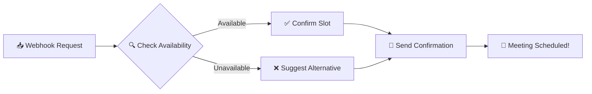
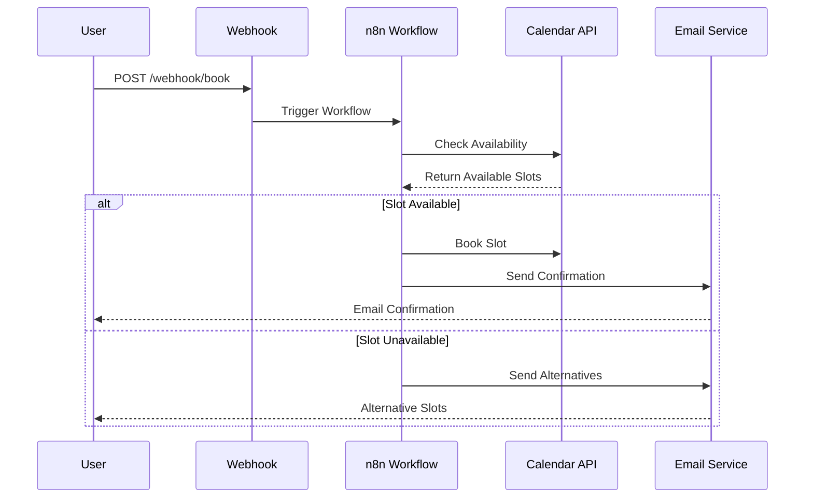

<div align="center">
 
# 🤖 MeetingSlot AI

### *Intelligent Meeting Scheduling Powered by n8n*
 


---

### 📬 **Never Miss a Meeting Again!**

*An automated, intelligent meeting slot booking system that handles availability, confirmations, and notifications — all without writing a single line of code!*

[🚀 Get Started](#-setup-instructions) • [✨ Features](#-features) • [💡 Contribute](#-ideas-to-improve)
 
</div>

---

## 🎯 What is MeetingSlot AI?

MeetingSlot AI is a **zero-code automation workflow** built with **n8n** that transforms how you handle meeting scheduling. Say goodbye to endless email chains and calendar conflicts!



---

## ✨ Features

<table>
<tr>
<td width="50%">

### 🎯 Core Capabilities
- 📥 **Webhook Integration** - Accept requests instantly
- 🗓️ **Smart Validation** - Check slot availability in real-time
- ✅ **Auto-Confirmation** - Instant booking confirmations
- 📧 **Multi-Channel Notifications** - Email, SMS, or Telegram
- 🔄 **Easy Customization** - Adapt to your workflow

</td>
<td width="50%">

### 🔌 Integrations
- 📅 **Google Calendar**
- 📝 **Notion Database**
- 💬 **Telegram Bot**
- 📧 **Email (SMTP)**
- 🔔 **Slack Notifications**

</td>
</tr>
</table>

---

## 🛠️ Tech Stack

<div align="center">


</div>

---

## 🔧 Setup Instructions

### Prerequisites
- n8n instance (cloud or self-hosted)
- Email/Telegram credentials (optional)
- Basic understanding of workflows

### 🚀 Quick Start

```bash
# Clone the repository
git clone https://github.com/deepakrajjs-29/MeetingSlot-AI.git

# Navigate to project directory
cd MeetingSlot-AI
```

### Step-by-Step Configuration

1. **Import Workflow**
   - Open your n8n instance
   - Import the `workflow.json` file
   - Activate the workflow

2. **Configure Webhook**
   ```
   Your webhook URL: https://your-n8n-instance.com/webhook/meeting-slot
   ```
   - Use n8n cloud URL or tunnel with `ngrok`

3. **Set Up Credentials**
   - Add email SMTP settings
   - Configure Telegram bot token (optional)
   - Connect Google Calendar API (optional)

4. **Customize Slot Logic**
   - Edit available time slots in the workflow
   - Set your timezone preferences
   - Define booking rules

5. **Test & Deploy**
   ```bash
   curl -X POST https://your-webhook-url \
     -H "Content-Type: application/json" \
     -d '{"name":"John Doe","email":"john@example.com","slot":"2024-01-15T10:00:00Z"}'
   ```

---

## 📸 Workflow Preview

<div align="center">

```
┌─────────────┐     ┌──────────────┐     ┌─────────────┐
│   Webhook   │────▶│   Validate   │────▶│   Confirm   │
│   Trigger   │     │     Slots    │     │   Booking   │
└─────────────┘     └──────────────┘     └─────────────┘
                            │                     │
                            ▼                     ▼
                    ┌──────────────┐     ┌─────────────┐
                    │   Suggest    │     │    Send     │
                    │ Alternative  │     │ Notification│
                    └──────────────┘     └─────────────┘
```

</div>

---

## 💡 Ideas to Improve

<details>
<summary>🎨 Click to see enhancement ideas</summary>

### Frontend Enhancements
- [ ] Beautiful web form for slot selection
- [ ] Real-time availability calendar view
- [ ] Mobile-responsive booking interface

### Backend Features
- [ ] AI-powered slot recommendations
- [ ] Multi-timezone support
- [ ] Recurring meeting automation
- [ ] Waiting list management

### Integrations
- [ ] WhatsApp Business API
- [ ] Zoom/Meet auto-link generation
- [ ] CRM synchronization (Salesforce, HubSpot)
- [ ] Payment gateway for paid bookings

### Advanced Logic
- [ ] Buffer time between meetings
- [ ] Priority-based booking
- [ ] Team availability aggregation
- [ ] Automatic rescheduling suggestions

</details>

---

## 📊 Architecture Diagram



---

## 🤝 Contributing

Contributions make the open source community amazing! Any contributions you make are **greatly appreciated**.

1. Fork the Project
2. Create your Feature Branch (`git checkout -b feature/AmazingFeature`)
3. Commit your Changes (`git commit -m 'Add some AmazingFeature'`)
4. Push to the Branch (`git push origin feature/AmazingFeature`)
5. Open a Pull Request

---

## 📫 Contact

<div align="center">

**Deepak Raj**

[](https://github.com/deepakrajjs-29)
[](mailto:deepakrajjs2909@gmail.com)

**Project Link:** [https://github.com/deepakrajjs-29/MeetingSlot-AI](https://github.com/deepakrajjs-29/MeetingSlot-AI)

</div>

---

## 📄 License

This project is licensed under the **MIT License** - see the [LICENSE](LICENSE) file for details.

---

## ⭐ Show Your Support

Give a ⭐️ if this project helped you!

<div align="center">

### 🎉 Happy Scheduling! 🎉

Made with ❤️ by [Deepak Raj](https://github.com/deepakrajjs-29)

---


</div>
